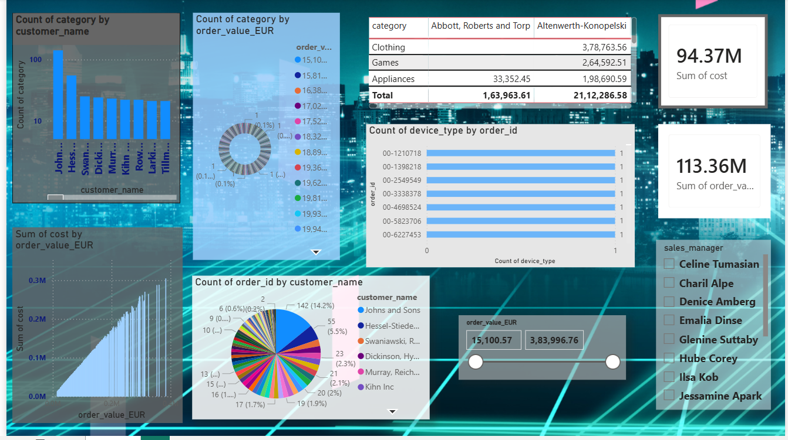

Sales Analytics Dashboard

This project showcases an interactive Sales Analytics Dashboard designed to provide insights into customer behavior, order distribution, and revenue performance.

 Overview

The dashboard visualizes key business metrics such as:

Total sales value
Total cost
Customer activity
Order distribution
Product categories
Device usage patterns

It enables users to quickly analyze trends, identify top-performing segments, and make data-driven decisions.

📈 Key Features
1. KPI Metrics
Total Cost: 94.37M
Total Order Value: 113.36M

These high-level indicators provide a quick snapshot of overall business performance.

2. Customer Insights
Bar chart displaying count of categories by customer
Pie chart showing order distribution across customers

Helps identify:

Top customers
Contribution distribution
3. Category Performance
Table comparing categories like:
Clothing
Games
Appliances
Metrics split across different vendors

Useful for analyzing:

Category profitability
Vendor performance
4. Order Value Analysis
Donut chart representing order value distribution
Scatter/area chart showing cost vs order value relationship

Highlights:

Revenue spread
Cost efficiency patterns
5. Device Usage Tracking
Bar chart displaying device type count by order ID

Useful for:

Understanding platform usage
Optimizing user experience
6. Interactive Filters
Sales Manager filter
Order value range slider

Allows dynamic exploration of:

Specific sales representatives
Custom value ranges
🛠️ Tools & Technologies
Data Visualization Tool (e.g., Power BI / Tableau / similar)
Data modeling and aggregation techniques
Interactive filtering and dashboard design
📌 Use Cases
Sales performance monitoring
Customer segmentation
Revenue and cost analysis
Business decision support
📷 Preview

📖 How to Use
Clone the repository
Open the dashboard file in the appropriate tool
Use filters and visuals to explore the data
